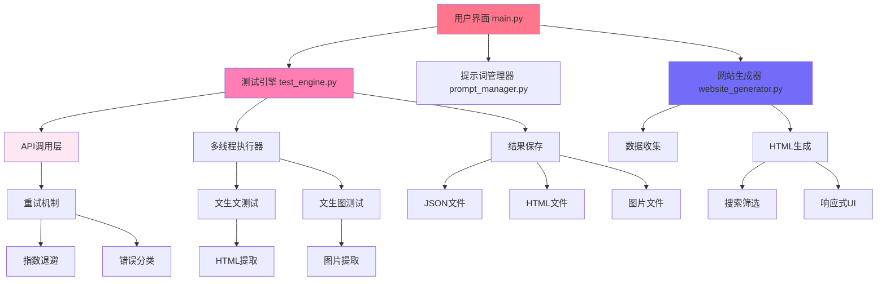

# 🎯 AI模型一键测评工具

<div align="center">


**快速、全面、美观的AI模型能力测评工具**

支持文生文、文生图测评 | 自动生成精美展示网站 | 智能筛选搜索 | 多线程并发 | 失败重试

[快速开始](#-快速开始) • [功能特性](#-核心特性) • [使用教程](#-使用教程) • [架构说明](#-架构设计) • [贡献指南](#-贡献指南)

</div>

---

## 📖 目录

- [项目简介](#-项目简介)
- [核心特性](#-核心特性)
- [快速开始](#-快速开始)
- [使用教程](#-使用教程)
- [架构设计](#-架构设计)
- [测试案例](#-测试案例)
- [展示网站](#-展示网站功能)
- [配置选项](#-配置选项)
- [常见问题](#-常见问题)
- [更新日志](#-更新日志)
- [贡献指南](#-贡献指南)
- [许可证](#-许可证)

---

## 🌟 项目简介

**AI模型一键测评工具**是一个专业的AI模型能力评估平台，帮助开发者和研究人员快速、全面地测评任何AI模型的性能表现。

### 为什么选择这个工具？

- **零代码操作** - 图形界面，无需编程基础
- **全面测评** - 25个精选测试案例，覆盖各种场景
- **美观展示** - 自动生成可交互的粉色风格展示网站
- **智能重试** - 自动重试失败测试，指数退避策略
- **高效并发** - 支持最多30线程并发测试
- **数据完整** - 保存所有测试结果和元数据

---

## ✨ 核心特性

### 🎨 用户界面

- **简洁图形界面** - 基于Tkinter的现代化GUI
- **实时进度显示** - 进度条 + 详细日志
- **一键式操作** - 配置→测评→查看，三步完成

### 🚀 测试引擎

- **智能重试机制** ⚡
  - 指数退避算法（2秒→4秒→8秒...）
  - 随机抖动，避免"惊群效应"
  - 区分可重试错误（429, 500, 502等）
  - 最多自动重试3次

- **多线程并发** ⚙️
  - 支持1-30线程可配置
  - 并行执行多个测试案例
  - 自动管理资源和异常

- **完善错误处理** 🛡️
  - 超时自动重试
  - 连接错误恢复
  - 详细错误日志

### 🎭 测试案例

- **文生文测试（10个案例）**
  - 视觉代码生成（SVG动画、3D图形）
  - 交互游戏（俄罗斯方块、弹球游戏）
  - 科学模拟（太阳系模拟器）
  - 实用工具（计算器、Markdown编辑器）

- **文生图测试（15个案例）**
  - 未来科技场景
  - 人物肖像
  - 建筑设计
  - 产品摄影
  - 自然风光

### 🎨 展示网站

- **智能搜索** 🔍
  - 支持搜索名称、ID、标签
  - 实时搜索，即输即显

- **多维筛选** 🎯
  - 按类型筛选（文生文/文生图）
  - 按难度筛选（简单/中/高）
  - 动态显示结果数量

- **美观设计** 💅
  - 可爱粉色风格
  - 每个案例专属图标
  - 流畅的悬停动画
  - 响应式布局

---

## 🚀 快速开始

### 系统要求

- **Python**: 3.7 或更高版本
- **操作系统**: Windows / macOS / Linux
- **网络**: 能访问AI API服务
- **内存**: 建议 2GB 以上

### 1. 克隆仓库

```bash
git clone https://github.com/147228/model-test-cc.git
cd model-test-cc
```

### 2. 安装依赖

```bash
pip install -r requirements.txt
```

**依赖列表**：
- `requests` - HTTP请求库
- `tkinter` - 图形界面（Python自带）

### 3. 配置API

方式一：使用GUI配置（推荐）
```bash
python main.py
```
在界面上填写API配置并保存。

方式二：手动配置
```bash
cp config.example.json config.json
# 编辑config.json，填入你的API信息
```

### 4. 开始测评

点击"开始测评"按钮，等待测试完成！

---

## 📚 使用教程

### 第一次使用

#### Step 1: 启动程序

**Windows**:
```bash
python main.py
# 或双击 启动.bat
```

**macOS / Linux**:
```bash
python3 main.py
```

#### Step 2: 配置API

在界面上填写以下信息：

| 配置项 | 说明 | 示例 |
|-------|------|------|
| API URL | API端点地址 | `https://yunwu.ai/v1` |
| API Key | 你的API密钥 | `sk-xxxxx...` |
| 文生文模型 | 代码生成模型 | `gemini-3-pro-preview` |
| 文生图模型 | 图像生成模型 | `gemini-3-pro-image-preview` |
| 并发线程 | 并发数（建议10-20） | `10` |

💡 **提示**：
- 首次测试建议并发数设为5，避免触发API限流
- API Key可以从你的AI服务提供商获取
- 不同模型的并发限制不同，请查阅服务商文档

#### Step 3: 选择测试类型

勾选要测试的类型：
- ✅ 文生文测评
- ✅ 文生图测评

你可以同时选择两者，也可以只选一种。

#### Step 4: 开始测评

点击"开始测评"按钮。测评过程中：
- 📊 实时显示进度条
- 📝 日志窗口显示详细信息
- ⏱️ 显示当前测试案例

测评时长：
- 文生文：约5-10分钟（取决于并发数）
- 文生图：约10-15分钟
- 总计：约15-25分钟

#### Step 5: 查看结果

测评完成后：
1. 点击"打开输出目录"按钮
2. 进入 `output/website/` 目录
3. 双击 `index.html` 在浏览器中打开

### 进阶使用

#### 自定义测试案例

1. 打开 `test_cases/text_cases.json` 或 `image_cases.json`
2. 按格式添加新的测试案例：

```json
{
  "id": "T11",
  "name": "我的自定义测试",
  "category": "自定义分类",
  "difficulty": "中",
  "tags": ["标签1", "标签2"],
  "icon": "✨",
  "prompt": "详细的测试提示词..."
}
```

#### 批量导入提示词

使用提供的导入工具：

```bash
python import_prompts.py
```

按照提示输入提示词文件路径即可。

#### 重试失败的测试

如果某些测试失败，程序会自动重试3次。如果仍然失败，你可以：

1. 检查网络连接
2. 确认API配额充足
3. 降低并发数后重新测试

---

## 🏗️ 架构设计

### 系统架构图



### 核心模块说明

#### 1. main.py - GUI主程序

**职责**：
- 提供图形用户界面
- 管理配置加载/保存
- 协调各模块工作
- 显示进度和日志

**核心类**：
```python
class AIModelTester:
    def __init__(self, root)
    def create_ui(self)
    def start_test(self)
    def load_config(self)
    def save_config(self)
```

#### 2. test_engine.py - 测试引擎

**职责**：
- 执行文生文/文生图测试
- 管理多线程并发
- 实现重试机制
- 保存测试结果

**核心类**：
```python
class TestEngine:
    # 重试配置
    MAX_RETRIES = 3
    BASE_DELAY = 2
    MAX_DELAY = 30

    def call_api_with_retry(self, ...)  # 带重试的API调用
    def run_text_tests(self)            # 执行文生文测试
    def run_image_tests(self)           # 执行文生图测试
    def retry_failed_tests(self)        # 重试失败案例
```

**重试策略**：
```python
# 指数退避算法
delay = min(BASE_DELAY * (2 ** attempt) + random.uniform(0, 1), MAX_DELAY)

# 可重试的HTTP状态码
RETRIABLE_STATUS_CODES = [429, 500, 502, 503, 504]
```

#### 3. website_generator.py - 网站生成器

**职责**：
- 收集测试结果
- 生成HTML展示网站
- 实现搜索和筛选功能

**核心类**：
```python
class EnhancedWebsiteGenerator:
    def generate(self)                # 生成网站
    def collect_results(self, type)   # 收集结果
    def generate_html(self, data)     # 生成HTML
    def generate_text_cards(self)     # 生成文生文卡片
    def generate_image_cards(self)    # 生成文生图卡片
```

#### 4. prompt_manager.py - 提示词管理器

**职责**：
- 管理测试用例
- 添加/编辑/删除案例
- AI生成提示词

**核心类**：
```python
class PromptManager:
    def load_cases(self, test_type)
    def save_cases(self, test_type, data)
    def add_case(self, test_type, case)
    def generate_prompts(self, ...)  # AI生成提示词
```

### 数据流图

```
用户输入 → 配置管理 → 测试引擎 → API调用（重试）→ 结果解析 → 文件保存
                                    ↓
                              多线程执行
                                    ↓
                          文生文测试 + 文生图测试
                                    ↓
                              结果汇总
                                    ↓
                          网站生成器 → HTML展示
```

### 文件结构

```
AI模型一键测评工具/
├── main.py                    # 🎨 主GUI应用
├── test_engine.py             # ⚙️ 测试引擎（带重试机制）
├── website_generator.py       # 🌐 网站生成器（增强版）
├── prompt_manager.py          # 📝 提示词管理器
├── import_prompts.py          # 📥 提示词导入工具
├── requirements.txt           # 📦 依赖列表
├── config.json                # ⚙️ 配置文件（自动生成）
├── config.example.json        # 📋 配置文件示例
├── README.md                  # 📖 项目文档
├── .gitignore                 # 🚫 Git忽略规则
│
├── test_cases/                # 📚 测试用例
│   ├── text_cases.json        # 10个文生文案例
│   └── image_cases.json       # 15个文生图案例
│
├── output/                    # 📊 输出目录（测试结果）
│   ├── text/                  # 文生文结果
│   │   ├── *.json             # 测试结果JSON
│   │   └── *.html             # 生成的HTML文件
│   │
│   ├── image/                 # 文生图结果
│   │   ├── *.json             # 测试结果JSON
│   │   └── *.jpg/png          # 生成的图片
│   │
│   └── website/               # 🌐 展示网站
│       ├── index.html         # 主页面
│       ├── data.json          # 数据文件
│       └── images/            # 网站图片资源
│
└── docs/                      # 📚 文档目录
    ├── 快速开始.md
    ├── 完整使用手册.md
    ├── 项目功能说明.md
    └── 项目对比说明.md
```

---

## 📝 测试案例

### 文生文测试（10个）

| ID | 名称 | 类别 | 难度 | 说明 |
|----|------|------|------|------|
| T01 | 机械花朵开合动画 | 视觉代码 | 中 | SVG机械动画，交互式 |
| T02 | 3D立方体动画 | 3D图形 | 中 | Three.js，可拖拽旋转 |
| T03 | 俄罗斯方块游戏 | 交互游戏 | 高 | 完整游戏逻辑 |
| T04 | 太阳系模拟器 | 科学模拟 | 高 | 8大行星运行模拟 |
| T05 | 音乐可视化 | 音频可视化 | 高 | Web Audio API |
| T06 | 粒子烟花效果 | 视觉效果 | 中 | 粒子系统+物理 |
| T07 | 计算器应用 | 实用工具 | 简单 | 四则运算 |
| T08 | 时钟与倒计时 | 实用工具 | 中 | 多功能时间工具 |
| T09 | 弹球碰撞游戏 | 交互游戏 | 中 | 物理引擎 |
| T10 | Markdown编辑器 | 实用工具 | 中 | 实时预览 |

### 文生图测试（15个）

| ID | 名称 | 类别 | 难度 | 风格 |
|----|------|------|------|------|
| I01 | 全息投影会议室 | 未来科技 | 高 | 科幻写实 |
| I02 | 赛博朋克街景 | 场景设计 | 高 | 霓虹+雨夜 |
| I03 | 古风少女 | 人物肖像 | 高 | 中国风 |
| I04 | 太空站内部 | 未来科技 | 高 | 科幻 |
| I05 | 魔法森林 | 奇幻场景 | 中 | 发光植物 |
| I06 | 智能手表 | 产品设计 | 中 | 商业摄影 |
| I07 | 龙在云端 | 奇幻生物 | 高 | 中国龙 |
| I08 | 现代建筑 | 建筑设计 | 中 | 极简主义 |
| I09 | 美食摄影-拉面 | 美食摄影 | 中 | 日式料理 |
| I10 | 水下世界 | 自然场景 | 中 | 珊瑚礁 |
| I11 | 赛博朋克街区 | 未来科技 | 高 | 机器人 |
| I12 | 晨光中的秘境森林 | 自然场景 | 中 | 瀑布+光线 |
| I13 | 沧桑渔夫特写 | 人物肖像 | 高 | 超写实 |
| I14 | 悬崖玻璃别墅 | 建筑设计 | 中 | 参数化设计 |
| I15 | 奢华香水广告 | 产品设计 | 简单 | 高端商业 |

---

## 🎨 展示网站功能

生成的展示网站位于 `output/website/index.html`，功能包括：

### 🔍 智能搜索
- 搜索测试案例名称
- 搜索案例ID
- 搜索标签关键词
- 实时搜索，即时显示结果

### 🎯 多维筛选
- **类型筛选**: 全部 / 文生文 / 文生图
- **难度筛选**: 全部 / 简单 / 中等 / 困难
- 动态显示筛选结果数量
- 一键重置所有筛选条件

### 💅 美观展示
- 粉色可爱风格设计
- 每个案例显示专属emoji图标
- 文生文案例：
  - 显示难度徽章
  - 显示技术标签
  - "查看演示"按钮可打开HTML
- 文生图案例：
  - 显示类别标签
  - 点击图片可放大预览
  - Lightbox灯箱效果

### ⚡ 流畅交互
- 卡片悬停放大效果
- 平滑的过渡动画
- 响应式布局，支持移动端
- 空状态友好提示

---

## ⚙️ 配置选项

### 配置文件格式

`config.json`:
```json
{
  "api_url": "https://yunwu.ai/v1",
  "api_key": "sk-your-api-key",
  "text_model": "gemini-3-pro-preview",
  "image_model": "gemini-3-pro-image-preview",
  "max_threads": 10
}
```

### 环境变量（可选）

你也可以使用环境变量配置：

```bash
# Linux/macOS
export OPENAI_API_KEY="sk-your-api-key"
export OPENAI_BASE_URL="https://yunwu.ai/v1"
export MODEL_NAME="gemini-3-pro-preview"

# Windows
set OPENAI_API_KEY=sk-your-api-key
set OPENAI_BASE_URL=https://yunwu.ai/v1
set MODEL_NAME=gemini-3-pro-preview
```

### 测试引擎配置

在 `test_engine.py` 中可以调整：

```python
class TestEngine:
    # 重试配置
    MAX_RETRIES = 3      # 最大重试次数
    BASE_DELAY = 2       # 初始延迟（秒）
    MAX_DELAY = 30       # 最大延迟（秒）
```

---

## ❓ 常见问题

### Q1: 测试失败怎么办？

**A**: 检查以下几点：
1. ✅ API Key是否正确
2. ✅ 网络连接是否正常
3. ✅ API配额是否充足
4. ✅ 模型名称是否正确

程序会自动重试3次，如果仍然失败：
- 降低并发线程数
- 检查防火墙/代理设置
- 联系API服务提供商

### Q2: 支持哪些AI模型？

**A**: 支持所有兼容OpenAI API格式的模型：
- ✅ OpenAI GPT-4 / GPT-3.5
- ✅ Anthropic Claude
- ✅ Google Gemini
- ✅ 通义千问
- ✅ 文心一言
- ✅ DeepSeek
- ✅ 任何OpenAI兼容的API

### Q3: 如何添加自定义测试案例？

**A**: 两种方式：
1. **手动编辑**：直接修改 `test_cases/*.json` 文件
2. **使用GUI**：点击"提示词管理"按钮（开发中）

### Q4: 展示网站可以部署吗？

**A**: 可以！`output/website/` 是纯静态网站，可以部署到：
- GitHub Pages
- Vercel
- Netlify
- 任何Web服务器

### Q5: 并发数设置多少合适？

**A**: 建议：
- **首次测试**: 5-10 线程
- **正常使用**: 10-20 线程
- **高性能**: 20-30 线程

注意：并发数过高可能触发API限流（HTTP 429）

### Q6: 重试机制是如何工作的？

**A**: 采用指数退避算法：
```
第1次失败: 等待 2-3秒
第2次失败: 等待 4-5秒
第3次失败: 等待 8-9秒
第4次失败: 放弃
```

只有以下错误会重试：
- 超时（Timeout）
- 连接错误（ConnectionError）
- HTTP 429, 500, 502, 503, 504

### Q7: 测试结果保存在哪里？

**A**: 所有结果保存在 `output/` 目录：
- `output/text/`: 文生文结果（JSON + HTML）
- `output/image/`: 文生图结果（JSON + 图片）
- `output/website/`: 展示网站

### Q8: 如何批量测试多个模型？

**A**:
1. 测试第一个模型
2. 复制 `output/` 目录并重命名（如 `output_gemini/`）
3. 修改配置，测试第二个模型
4. 重复以上步骤

---

## 📅 更新日志

### v2.0 (2025-11-24)

✨ **新功能**
- 🔄 增加智能重试机制（指数退避）
- 🔍 增强版展示网站，支持搜索和筛选
- 🎨 动态图标系统，每个案例专属emoji
- 🏷️ 标签系统，按技术标签分类
- ⭐ 难度标签，清晰显示测试难度
- 🖼️ 15个文生图测试案例（新增5个）

🔧 **改进**
- ✅ 优化所有测试案例提示词
- ✅ 改进数据结构，保存完整元数据
- ✅ 优化展示网站样式
- ✅ 添加空状态提示
- ✅ 完善错误处理

🐛 **修复**
- 修复图片base64数据导致JSON过大的问题
- 修复部分测试案例描述不清晰的问题
- 修复API调用失败不重试的问题

### v1.0 (2025-11-24)

- 首次发布
- 支持文生文和文生图测评
- 内置20个测试用例
- 自动生成展示网站

---

## 🤝 贡献指南

欢迎贡献！以下是参与方式：

### 提交Issue

遇到问题或有建议？[创建Issue](https://github.com/147228/model-test-cc/issues/new)

### 提交Pull Request

1. Fork本仓库
2. 创建特性分支 (`git checkout -b feature/AmazingFeature`)
3. 提交更改 (`git commit -m 'Add some AmazingFeature'`)
4. 推送到分支 (`git push origin feature/AmazingFeature`)
5. 创建Pull Request

### 开发规范

- 遵循PEP 8代码风格
- 添加必要的注释和文档
- 测试你的更改
- 更新README（如果需要）

### 贡献领域

- 🐛 Bug修复
- ✨ 新功能
- 📝 文档改进
- 🌐 国际化（i18n）
- 🎨 UI/UX改进
- 📦 新测试案例

---

## 📜 许可证

本项目采用 MIT 许可证 - 详见 [LICENSE](LICENSE) 文件

```
MIT License

Copyright (c) 2025 夕小瑶科技

Permission is hereby granted, free of charge, to any person obtaining a copy
of this software and associated documentation files (the "Software"), to deal
in the Software without restriction...
```

---

## 🙏 致谢

感谢以下项目的灵感和参考：

- **OpenAI API** - API接口设计
- **Three.js** - 3D图形库
- **Marked.js** - Markdown解析

---

## 📞 联系方式

- **项目主页**: https://github.com/147228/model-test-cc
- **问题反馈**: [GitHub Issues](https://github.com/147228/model-test-cc/issues)
- **开发者**: 夕小瑶科技

---

<div align="center">

**如果觉得这个项目有帮助，请给个⭐Star⭐支持一下！**

Made with ❤️ by 夕小瑶科技

*低负担解码AI世界，硬核也可爱！*

</div>
